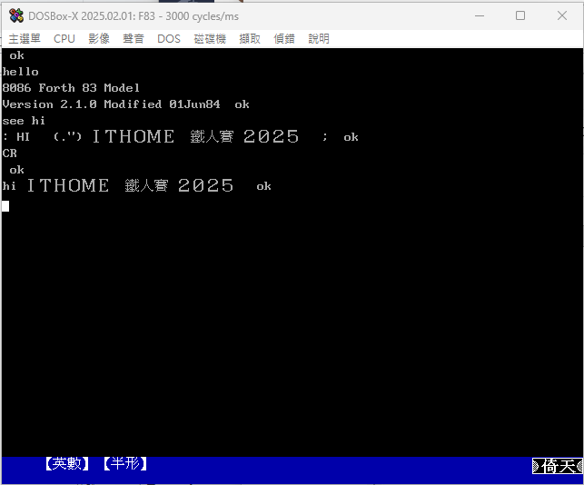

# 如何在 IBM PC 上執行中文系統?

## 2025 年執行 DOS 下中文系統的方法

每當要跟現在的學生提到倚天中文時，就會想到 Youtube 上那段經典的[「倚天中文系統教學影片」](https://www.youtube.com/watch?v=9AvF7xsFq4g&t=92s)


現在要找到當年的軟硬體並非容易的事情(可能連使用手冊都被圖書館給報廢了)。在 2025 年執行 Windows 11 作業系統的環境下，你可以下載 **DosBox**、**VirtualBox**、**Qemu** 這類的模擬器軟體，從安裝 DOS 開始，再安裝倚天中文、國喬中文、零壹中文等中文系統。

所幸現在在 Internet Archive 網站上已經有相關的中文系統檔案可以下載。如果想要體驗當年執行 PE2 文書處理軟體或是開發 C 語言程式的讀者，可以參考底下的連結。

[ETen Chinese System 3.53 (Traditional Chinese)](https://archive.org/details/et353_tw)


我們來做一個小練習，試著編寫一段中文小程式，然後在 DOS 環境下執行。

必備軟體:

1. DOSBox-X
2. ET3 倚天中文
3. F83 (Forth 語言開發軟體)

### 安裝 DOSBox-X

```
C:\Users\daniel>winget search DOSBox
名稱            識別碼                      版本       相符        來源
-------------------------------------------------------------------------
DOSBox          DOSBox.DOSBox               0.74-3                 winget
DOSBox Staging  DOSBoxStaging.DOSBoxStaging 0.82.2     Tag: dosbox winget
DOSBox-X        joncampbell123.DOSBox-X     2025.05.03 Tag: dosbox winget
DOSBox SVN-Daum ykhwong.DOSBoxSVN-Daum      20150125               winget

C:\Users\daniel>winget install joncampbell123.DOSBox-X
```

### 掛載目錄變成 DOS 下的磁碟機

```
mount c e:\myF83
c:
```

掛載磁碟機後，這時可以切換到 ET3 的目錄，執行 `ET3.bat` 載入倚天中文系統

### 試著執行 F83 來寫一個簡單的中文程式

```
F83 
```



執行的影片

