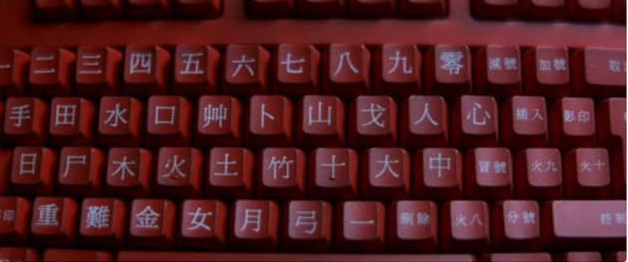

# 倉頡輸入法當年為何普及率最高

你是否有看過 007 的明日帝國電影出現的這張圖片?

如果你能會心一笑，那麼你當年應該有聽過也練過倉頡輸入法。

## 放棄專利，讓推廣活動沒有阻礙

根據 Wiki 百科對於[**倉頡輸入法8**](https://zh.wikipedia.org/wiki/%E5%80%89%E9%A0%A1%E8%BC%B8%E5%85%A5%E6%B3%95)的描述:

> 1982年，朱邦復登報公開放棄倉頡輸入法專利權，並且極力推動電腦漢化。現今大部分作業系統，甚至一些電子辭典皆附有倉頡輸入法，正體中文鍵盤也大多印有倉頡輸入法的字根。在正體中文世界裡，倉頡輸入法是極普及的形碼輸入法。

國家教育研究電子報，第33期 2012-02，[教育科技的專利與普及](https://epaper.naer.edu.tw/edm?edm_no=33&content_no=875)一文，朱麒華副研究員也有提到:

>民國71年11月27日經濟日報有一個版面很小的報導，但它的影響力卻無遠弗屆。『…朱邦復及施振榮鑑於倉頡字母輸入法應屬文化資產，決定放棄所有權，公諸整體資訊業採用，…』當時朱先生為零壹電腦公司負責人，施先生為宏碁公司總經理，兩人為了促成中文資訊的的標準化，放棄專屬權利，讓大家都可以使用倉頡輸入法來輸入中文。

## 技術優勢：速度快、可輸入全部中文

* 單字輸入速度快：倉頡是「形碼輸入法」，每個字通常 2–5 鍵就能打出來，熟練者每分鐘上百字不是問題。
* 字庫完整：不像注音輸入法只能輸常用字，倉頡可以輸入幾乎所有中文字，包括生僻字、專有名詞。
* 避免同音字困擾：中文同音字太多，注音/拼音輸入常需要選字，倉頡則是「一碼一字」，效率更高。

## 時代背景：DOS/中文系統盛行

* 在 DOS 時代 (1980s–1990s)，主流中文系統（倚天中文、國喬中文、零壹中文）幾乎都內建倉頡輸入。
* 電腦教室、打字班、補習班普遍教倉頡，很多人是「上電腦課」時直接學倉頡。
* 出版、報社、公家單位大量使用倉頡輸入法，成為「職場標準技能」。

## 政策與教育推廣

* 朱邦復將倉頡授權免費給政府單位與教育體系使用，普及速度非常快。
* 教育與考試支援：很多學校開課教倉頡，甚至部分公務員考試規定需會倉頡。
* 台灣政府電腦化政策：1980s–1990s 的資訊教育普及，倉頡被當成「正式中文輸入方案」。

## 軟硬體廠商的支持

* 電腦廠商（如宏碁、佳佳）在出貨的電腦中，內建倉頡。
* 軟體廠商（像倚天中文系統）都把倉頡當作主要輸入法。
* 印表機、字型廠商也支援倉頡碼表，便於排版印刷。
