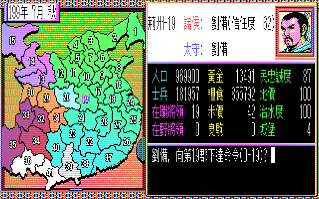
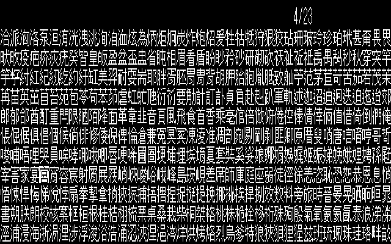

# 你用過的第一套中文系統是?

## 天龍中文系統

用過天龍中文系統的人應該不多，在台灣光華雜誌，1982年五月份有一篇報導[「中文電腦的研究、發展與運用」](https://www.taiwan-panorama.com/Articles/Details?Guid=ddf5ac84-f8ae-4cb7-837b-6eb51ca15a05&CatId=9&postname=%E4%B8%AD%E6%96%87%E9%9B%BB%E8%85%A6%E7%9A%84%E7%A0%94%E7%A9%B6%E3%80%81%E7%99%BC%E5%B1%95%E8%88%87%E9%81%8B%E7%94%A8&srsltid=AfmBOooFeuLjm0oj63Ti3dXMIyadcVgYeRtmygT9Asi160FjEACf5-o8)，有天龍中文電腦的近距離使用照片。

## 倚天中文與其他中文系統

寫這次鐵人賽文章時，做了一些搜尋，發現[「某廢柴的廢棄日記」](https://scrappedblog.blogspot.com/2014/01/dos-chinese-system-1.html)有針對 DOS中文系統懷古進行一系列介紹。歡迎有興趣的讀者可以前往欣賞。

最特別的是看到倚天中文2000視窗版的畫面，才想起當年剛轉換 Windows 95系統時，很多企業學校還要繼續使用 DOS 版的應用軟體，很多單位都有採購這套中文系統。

註: 圖片來源 【某廢柴的廢棄日記】

## 國喬中文系統

註: 圖片來源 [【某廢柴的廢棄日記】](https://scrappedblog.blogspot.com/search/label/Chinese%20System)

## 龍碟中文系統

作者有提到龍碟中文系統跟第三波文化事業旗下的中文化版本遊戲有關係，像是三國志系列遊戲。

註: 圖片來源 [【某廢柴的廢棄日記】](https://scrappedblog.blogspot.com/search/label/Chinese%20System)

三國志II 遊戲畫面

新君主選擇姓名選字畫面

## IBM DOS/V 移植過來的繁體中文 PC-DOS

在那個尚未進入網際網路流行的年代，DOS 系統可不是只有 MS-DOS，藍色巨人 IBM 也有推出過 PC-DOS，更特別的是，他是有含繁體中文系統。

註: 圖片來源 [【某廢柴的廢棄日記】](https://scrappedblog.blogspot.com/search/label/Chinese%20System)

## 蘋果電腦中文系統

我在 [「被遺忘的角落」](https://feng270.blog.fc2.com/blog-entry-130.html)部落格中找到幾篇有關早期蘋果電腦中文系統的介紹。

作者是用模擬器來執行當年的系統，很有意思的事情是，系統已經有內建四種中文輸入法。

也有點陣字編輯軟體

註: 圖片來源 [被遺忘的角落](https://feng270.blog.fc2.com/blog-entry-130.html)

## MacOS 7.5

這系統剛好是在 1995 年網際網路剛起步的年代。多數人用著 Modem 撥接上網，這時台灣蘋果電腦公司授權大同公司等台灣電腦廠商銷售一款叫做 Performa 5200CD 的電腦，裡面就有內建這套系統。這款電腦主要就是要給小孩子學電腦與上網使用。

我記得當年上網時，就是使用漢音輸入法，不需要再學倉頡的拆字，就能自動選字，真快樂!

註: 圖片來源 [被遺忘的角落](https://feng270.blog.fc2.com/blog-entry-130.html)

明天來回顧一下，DOS 時代的經典軟體。

