# DOS 年代有特色的繁體中文應用軟體有哪些

## 經典的軟體

當年光華商場販賣大補帖的攤販橫行的年代，宣傳靠著一份一份的軟體目錄，如果軟體不受歡迎，是無法被收錄到光碟裡。DOS年代的軟體如果要顯示中文訊息，往往都要載入中文系統。能不進中文系統，卻能自由瀏覽中文目錄，這樣的神奇軟體，就成為當年必備的工具。

當年的大補帖還要教使用者如何驅動光碟機，要不然連光碟資料都讀不到。

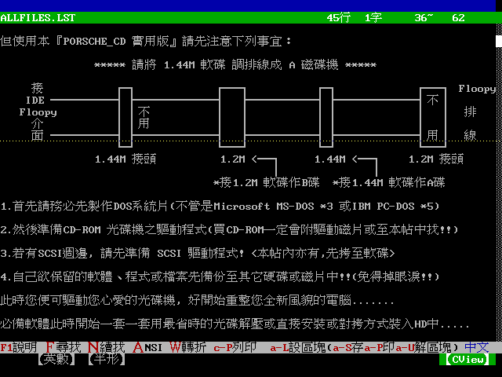

DOS 環境下，連記憶體都要斤斤計較，記憶體不符最低要求，軟體就無法執行。

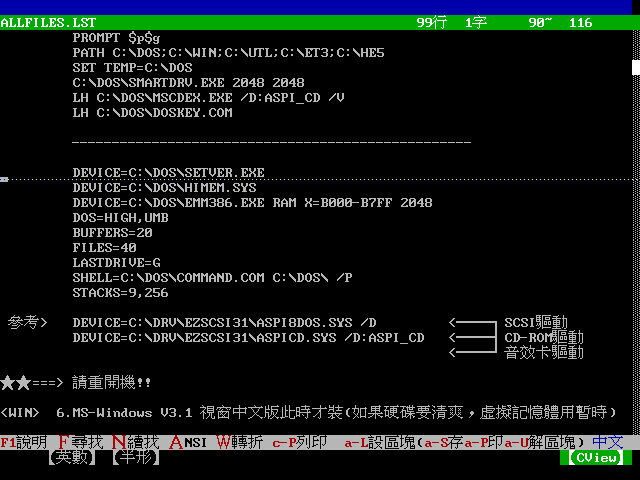

手邊已經沒有相關的繁體中文 DOS 軟體，就只有這份清單，我們來看看當年收錄哪些經典軟體。

### 中文系統

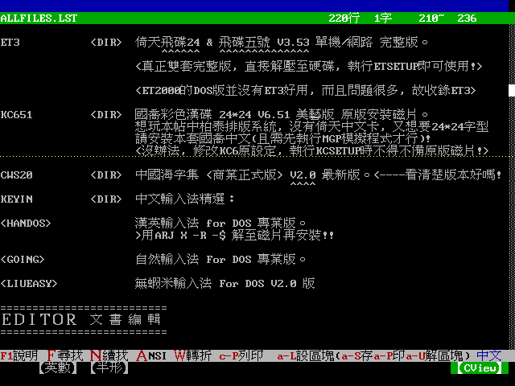

* 倚天中文、國喬中文就是常用的中文系統。
* 有人有用過漢英輸入法 DOS 版嗎?(這應該是「漢音輸入法」吧!)
* 沒想到當時就有「自然輸入法」。

### 文書編輯軟體

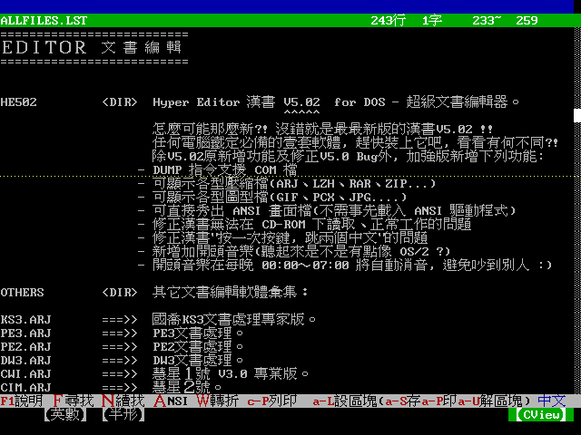

* 最有名的就是漢書，記得國中電腦課就要用漢書印課表

### 資料庫管理軟體

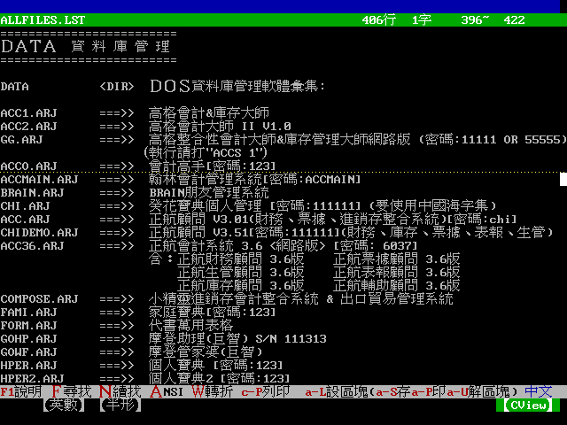

* 那時電腦店架上會擺上一堆會計套裝軟體，讓企業經營者來購買，導入資訊系統。

### 電腦字典

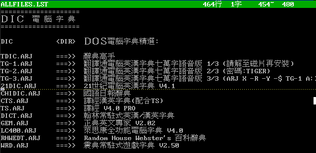

沒有Google 翻譯、智慧型手機的年代，要查英文單字意思，就只能翻字典與電子辭典。有電腦版的字典，可以查到更多的例句與說明。應該是當年五專與大學生必備的工具。

### 算命軟體

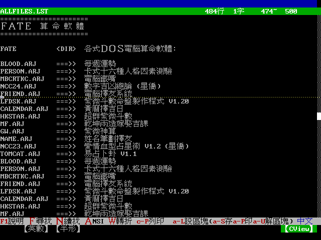

## CVIEW

CVIEW 就是這麼神奇的軟體，作者使用 F-PC 這套 Forth 語言開發，大概是那個年代，最小最方便的檔案管理軟體。到現在 2025年，依然能在網路上找得到。

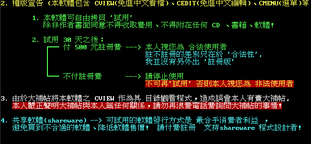

看到這個頁面，就知道當年 CVIEW 作者的無奈。軟體好用到被各家大補帖業者收錄。

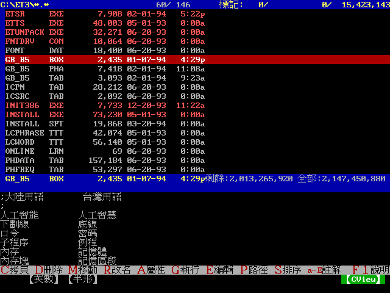

CVIEW 的好用就在於，開檔速度快，下方有個快速檢視的視窗，可以即時看到檔案內容。又有檔案管理、檔案壓縮功能。適當設定後，可以不離開軟體，即時看圖。幾乎就是那年代完美的「檔案總管」。

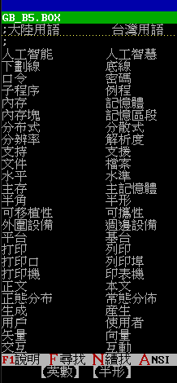

* 那個年代開放大陸探親，也有不少人到大陸經商。因此兩岸用語對照表是很熱門的檔案，大家都會 Copy 來 Copy 去。

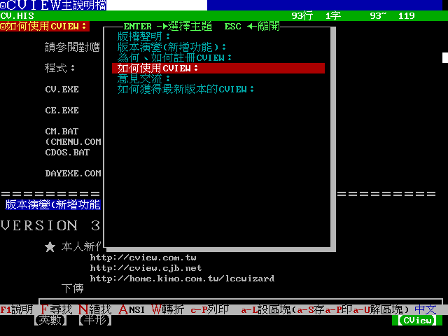

CVIEW 有完善的使用教學說明。