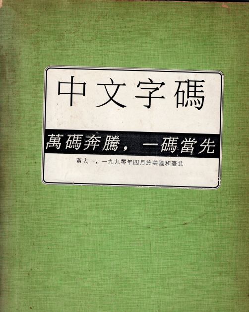
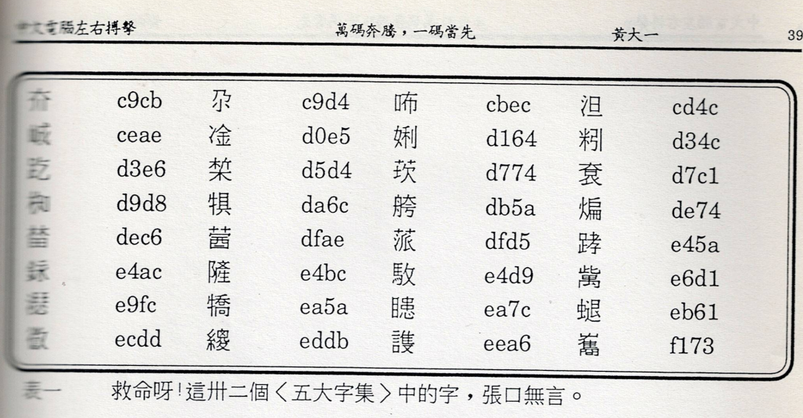
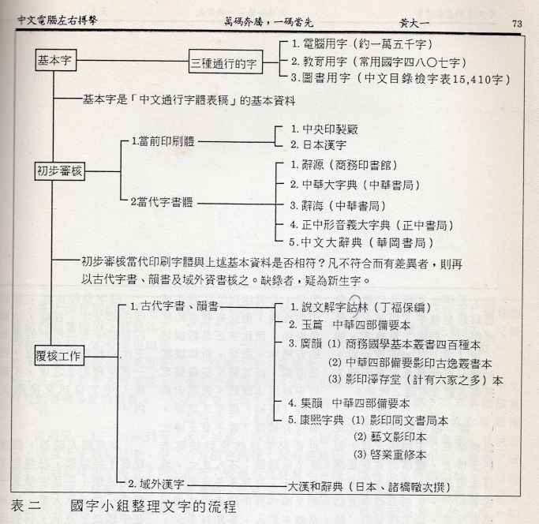
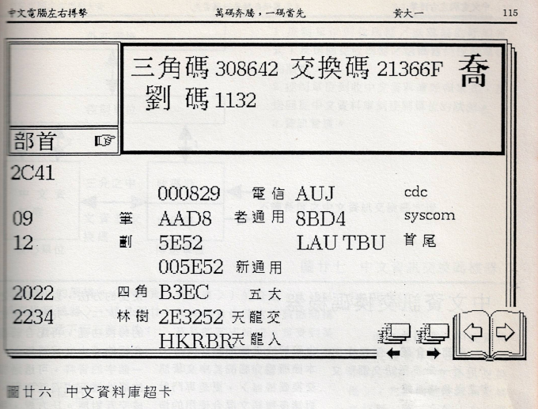

# 萬碼奔騰的年代

雖說黃大一老師的一貫風格就是據理力爭，語不驚人死不休。但他編著的「萬碼奔騰，一碼當先」確實很有可看性。光從附錄引用的參考資料來源，就是早期針對中文編碼技術、歷史發展研究，很有價值的參考資料。

## 萬碼奔騰，一碼當先目錄

- 說在前面
  - Bit(爻)
  - Byte(八元)
  - Kilobyte(千元)
- 不是中文電腦化，而是電腦中文化
- 必也正名乎
  - 標準
  - 字的種種定義問題
    - 字(Character)
    - 字型(Character Shape)
    - 正體字(Orthographics)
    - 異體字(Variants)
    - 字樣(Glyph)
    - 字體(Font)
    - 字集(Character Set)
    - 字碼(Character COde)和字碼空間(Coding Space)
    - 美國標準資訊交換碼(ASCII)
    - 國際標準組織(ISO)646
    - 字面(Character Plane)
    - 國際標準組織(ISO)2022
    - 國際標準組織ISO DP 10646草案
- 五胡亂華碼群簡介
  - 日本工業標準X 0208-1983
  - 中國大陸 GB 2312-80
  - 五大內碼
  - 通用漢字標準交換碼 CNS11643
  - 數據通信中文碼
  - 公會推薦中文內碼
  - 統一碼
- 中文資訊交換碼
  - 一點點的歷史回顧: 國字整理小組
  - 發展歷程
- 中文資訊交換碼的字碼架構
  - 收字的原則
  - 字型的原則
  - 字序的原則
  - 編碼的原則
  - 字碼架構的持久性
  - 有容乃大的特性
- 中文資訊交換碼的特性
  - 一、最大的字碼空間
  - 二、完全遵照國際標準組織六四六和二零二二的規定
  - 三、和已有的公用常式共容
  - 四、正體字和異體字轉換容易
  - 五、容許部分使用
- 中文資訊交換碼的應用
  - 中文資訊交換碼的子集合
  - 字碼壓縮
  - 字碼矩陣的翻轉
- 中文資料庫
  - 國字屬性資料檔
  - 字碼交互索引表
  - 音綴拼音系統對照表
  - 字體檔案群
  - 索引檔案群
  - 麥金塔電腦上的中文資料庫超卡
- 中文資訊交換碼機器
- 中文資訊交換碼結論
- 中文字碼評估
  - 字數
  - 字碼空間和字碼架構
  - 字集
  - 字碼長度
  - 字型正確
  - 字序
  - 合乎國際標準646和2022?
  - 正體字和異體字
  - 字面轉換的代價
  - 相伴的資料庫
  - 實用情況
  - 字碼綜合比較表
- 中文字碼和作業系統的關係
- 參考資料

## 本書精選圖片

在當年翻遍字典也找不到讀音的次常用字，不知道是什麼標準收錄其中。

國字整理小組整理文字流程

黃大一先生編著的超卡(HyperCard)版中文資料庫，執行畫面

