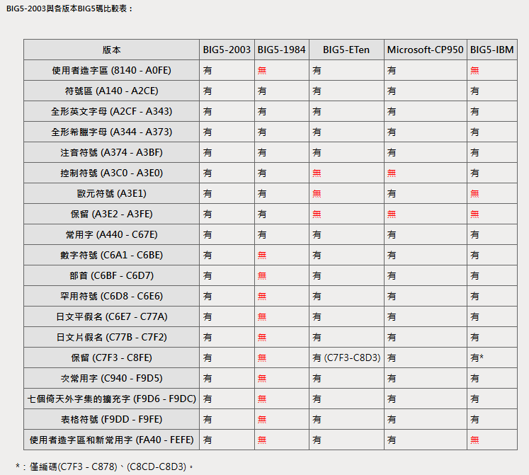
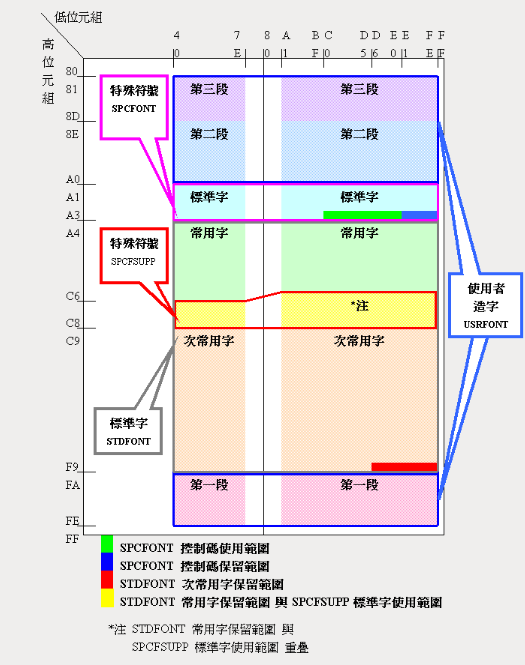
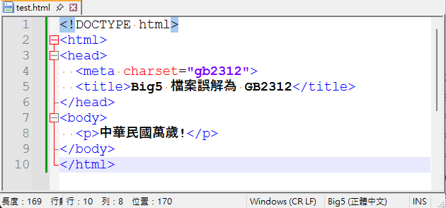
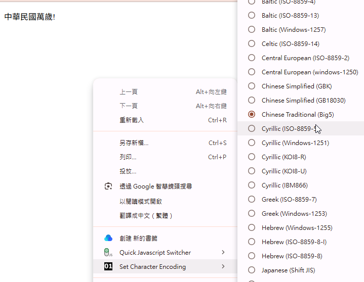

# Big5 與 GB 碼是什麼

我們就用數位發展部的全字庫網站上的編碼介紹資料來說明 Big5 編碼與 GB 編碼吧。

[全字庫中文碼介紹](https://www.cns11643.gov.tw/pageView.jsp?ID=9#encode2)

## Big5 碼簡介

* 係由資策會於1984年策劃制定，宗旨原是儘量不使用到控制碼範圍，並配合國人自制的五大(BIG-5)套裝軟體。由於委託民間設計，導致初期的BIG-5碼並不能使用五大套裝軟體。雖然如此，市面上絕大多數的套裝軟體都是在BIG-5內碼系統發展出來的，因此目前市面上有2-3個BIG-5碼版本，對使用者來說很難明白其中差異。
* 由於各家電腦系統使用的 BIG5 版本差異，造成不同系統之間檔案交換與資料庫轉換上經常會有問題。各位可參考網站中的版本差異表。




* 加上 Big5 編碼過去收錄的常用字與次常用字太少，造成許多單位公務使用上必須要造字。例如戶政單位接受民眾報戶口，民眾使用康熙字典上的字為孩子命名使用。小朋友長大後，要入學，學校的系統無法顯示該字，就要另外造字。諸如此類的問題層出不窮。各單位自行造字的時間、字型均不相同，彼此編碼原則也不盡相同，就造成後來不同系統間無法轉換的問題。




* Big-5碼香港增補字符集(zh_HK.hkbig5)，香港地區也是使用繁體字。因當時香港地區為英國殖民統治，中華民國是無法管到香港電腦行業發展與相關的標準制定。雖說大家彼此有默契，讓 Big5 編碼盡量一致，但為了香港人平日的用字習慣，還是收入了香港地區慣用的字詞。

字義上的區分：
某些字在香港和台灣有不同的字義分工，例如香港的「邨」與「村」、「着」與「著」在香港有不同的客觀字義區別，這使得它們不能被視為簡單的異體字。
具體的範例字有：

- 「邨」（村落）
- 「着」（衣著、穿著）
- 「綫」（線條）
- 「强」（力量）
- 「鬪」（打鬥）
- 「裏」（裡面）
- 「峯」（山峰）
- 「牀」（床鋪）
- 「羣」（人群）
- 「衞」（衛生） 

## GB 碼簡介

* GB 2312 碼是中華人民共和國國家標準漢字信息交換用編碼，全稱《信息交換用漢字編碼字符集基本集》，標準號為 GB 2312－80（GB 是 **國標** 二字的漢語拼音縮寫），由中華人民共和國國家標準總局發佈，1981年5月1日實施。
* GBK編碼(Chinese Internal CodeSpecification)是中華人民共和國制訂的、等同於UCS中新的中文編碼擴展國家標準。GBK編碼能夠用來同時表示正體字和簡體字，而GB2312只能表示簡體字。GBK工作小組於1995年10月，同年12月完成GBK規範。該編碼標準相容GB2312，共收錄漢字70205個、符號883個，並提供1894個造字碼位。

簡單來說，因為政治原因，兩岸加上港澳地區分別給不同政府管理，而中文本身就是個複雜的語言系統，各地區有著不同文化與用字習慣。由於過去資訊科技受軟硬體資源不足限制，無法收錄足夠數量的字，又因政治問題，無法有效組成管理委員會進行研究與規範，才造成現今編碼問題。

## 網頁瀏覽亂碼實例

我們用一段簡單的網頁來模擬:

請將檔案用 big5 編碼存成 **test.html**。

```
<!DOCTYPE html>
<html>
<head>
  <meta charset="gb2312">
  <title>Big5 檔案誤解為 GB2312</title>
</head>
<body>
  <p>中華民國萬歲!</p>
</body>
</html>
```



變成看不懂的亂碼頁面


要指定正確的編碼 Big5 才能正常顯示


