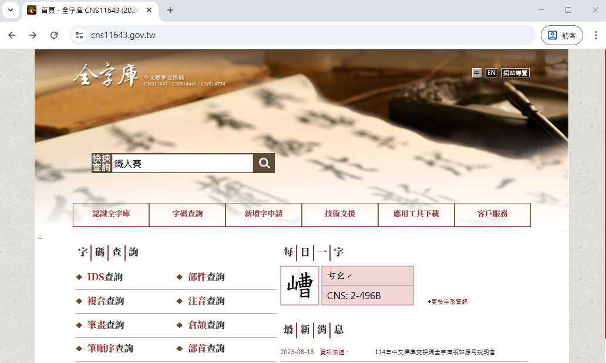
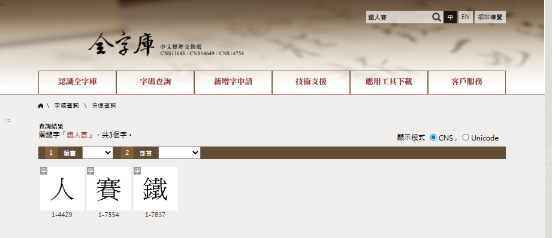
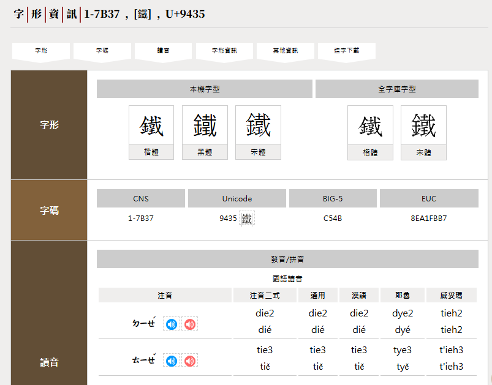
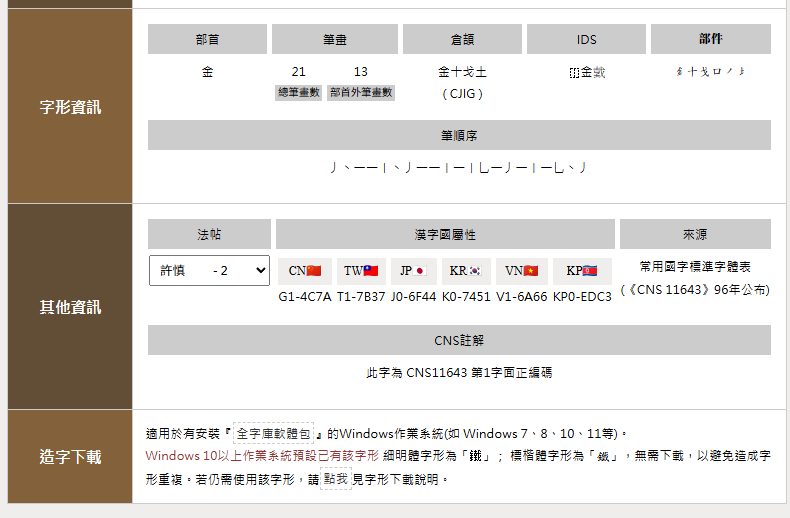
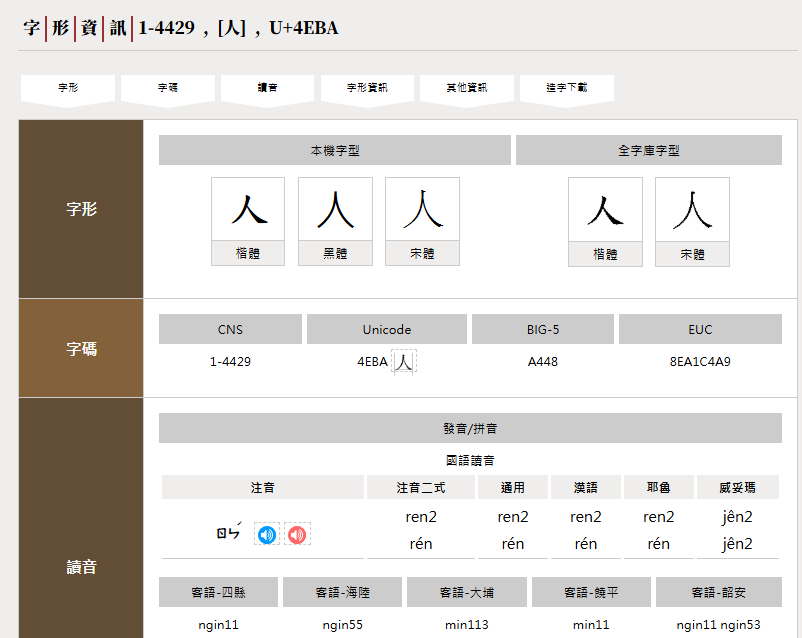
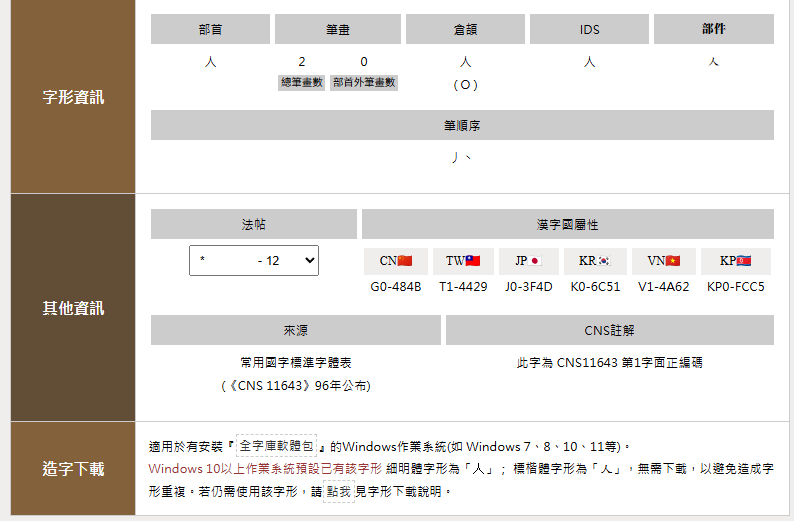
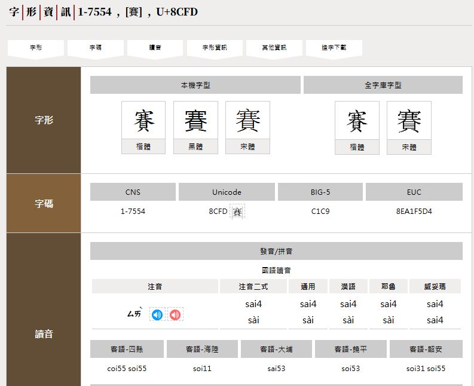
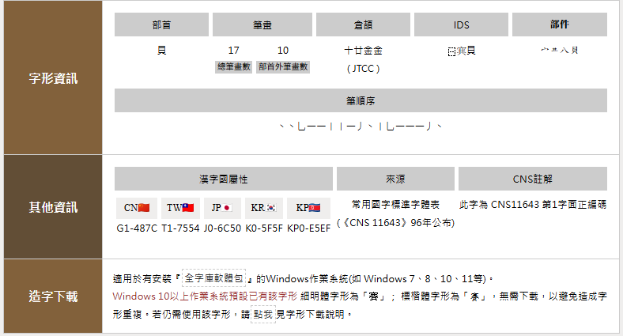

# CNS11643 全字庫要解決什麼問題

## 全字庫的任務

CNS11643「中文標準交換碼全字庫」是台灣官方主導的大型文字編碼計畫。早期電腦只支援英文，中文電腦化要能處理成千上萬的字，就需要一個完整的字碼系統。CNS11643 便是中華民國國家標準，把常用到罕用的中文字、符號、部首都整理進一套分層的編碼表格。簡單說，它就像一個「中文字的身分證系統」，每個字都有唯一的代號。

全字庫的工作不只是編碼，還包括補字、正名、異體字整理，甚至提供字形檔和查詢工具。舉例來說，有些古籍或地名裡會出現罕見字，以前電腦打不出來，透過全字庫的補字機制，這些字就能被正式收錄，學術研究或公文處理才能更完整。它也會和 Unicode 對應，確保台灣的用字能跟國際標準接軌。總的來說，全字庫就是一個「中文數位基礎建設」，讓中文資訊在電腦世界裡能準確、完整又一致地被保存和交換。

## 全字庫使用入門教學

我們用 **鐵人賽** 三個字來查，看全字庫能給我們什麼相關資料?

* [全字庫網址](https://www.cns11643.gov.tw/)

在快速查詢處，輸入「鐵人賽」。

查詢結果

### 鐵

* 字形
  * 本機字型
  * 全字庫字型
* 字碼
  * CNS:　1-7B37
  * UNICODE: 9435
  * BIG-5: C54B
  * EUC: 8EA1FBB7
* 讀音
* 字形資訊
  * 部首: 金
  * 筆畫: 21 / 13 
  * 倉頡: 金十戈土
  * IDS
  * 部件
  * 筆順序 
* 其他資訊
* 造字下載

### 人

* 字形
  * 本機字型
  * 全字庫字型
* 字碼
  * CNS:　1-4429
  * UNICODE: 4EBA
  * BIG-5: A448
  * EUC: 8EA1C4A9
* 讀音
* 字形資訊
  * 部首: 人
  * 筆畫: 2 / 0
  * 倉頡: 人
  * IDS
  * 部件
  * 筆順序 
* 其他資訊
* 造字下載

### 賽

* 字形
  * 本機字型
  * 全字庫字型
* 字碼
  * CNS:　1-7554
  * UNICODE: 8CFD
  * BIG-5: C1C9
  * EUC: 8EA1F5D4
* 讀音
* 字形資訊
  * 部首: 貝
  * 筆畫: 17 / 10
  * 倉頡: 十廿金金
  * IDS
  * 部件
  * 筆順序 
* 其他資訊
* 造字下載

