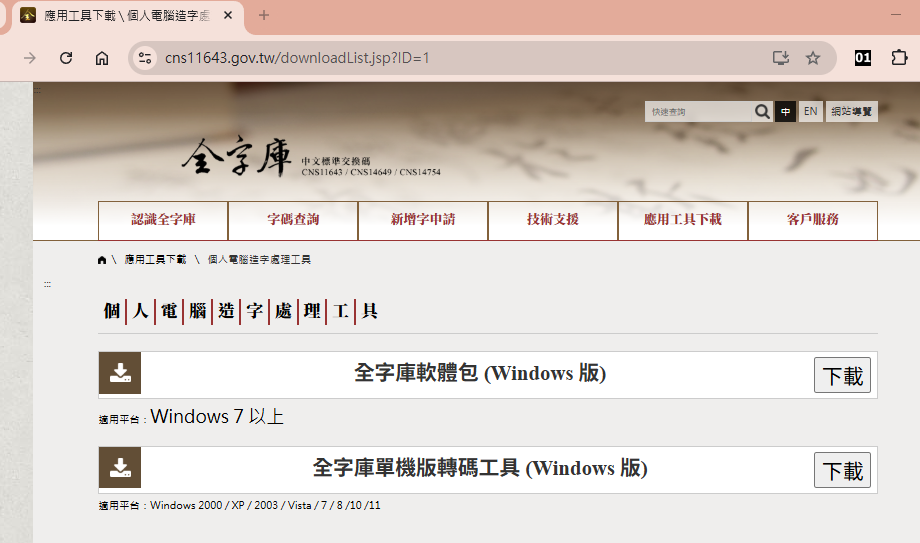
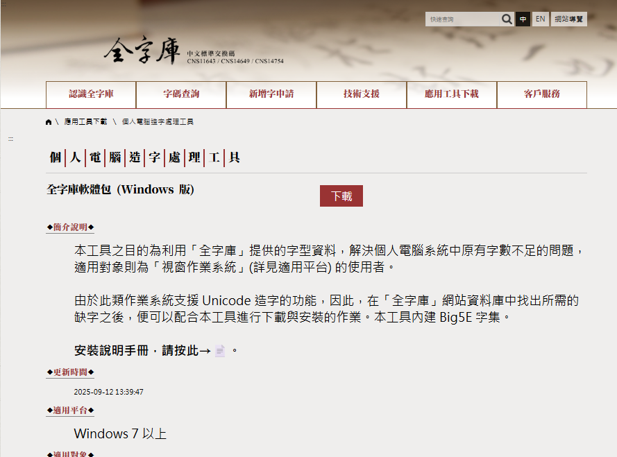
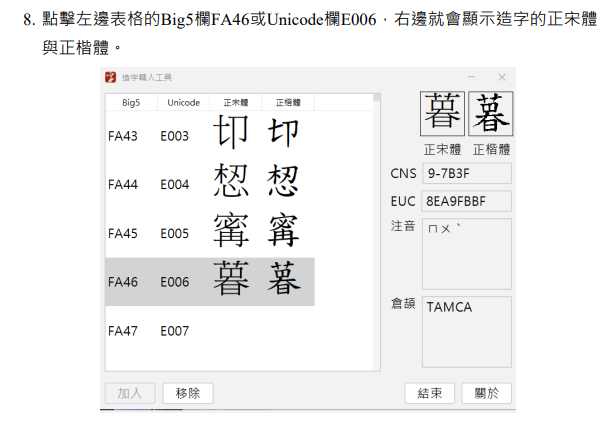
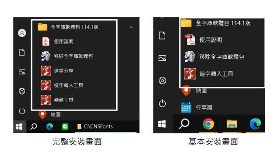
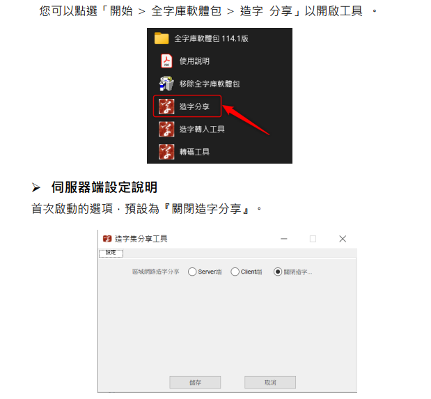

# 全字庫的自造字功能

為什麼要自造字呢?

* 系統內建字型不夠用
早期電腦的字型庫有限，遇到生僻字（例如台灣地名或人名的特殊漢字）就沒辦法顯示，這時只能自己造字。

* 不同地區有不同需求
台灣、香港、中國、日本…各地的用字習慣不同，常常有官方標準字庫裡沒有的字，為了在文件、資料庫或公文上正確顯示，就得自造字。

* 專業領域需要特殊符號
化學、數學、工程、醫學…有時會用到特殊符號或記號，這些在標準字型裡找不到，所以研究單位或公司就會自己造。

* 避免文字顯示亂碼
如果遇到電腦系統不支援的字，會出現「豆腐空格」或「亂碼」，很不方便。自造字可以解決這種「看不到正確字」的問題。

* 維護資訊一致性
例如：人事系統裡員工的名字有冷僻字，如果不同人電腦顯示不一樣，會造成混亂。自造字能確保大家看到的字一致。

* 傳統習慣與文化保存
有些姓氏或古籍裡的字，Unicode 或常用字集沒有收錄，但實際生活中還在用。自造字就是一種數位化保存的方式。

* 教學使用故意造的 **錯字** 
有時為了語文教學，故意要造字形相似，但筆順或是筆劃是錯誤的字形，給考試、課堂教學使用。

## 全字庫的造字管理工具

* [軟體安裝說明手冊](https://www.cns11643.gov.tw/files/files/readme-win.pdf)

### 新增造字

輸入造字的方法，雖然全字庫說明文件說可適用「微軟注音」輸入法，但以個人使用經驗，最好還是使用內碼輸入法來輸入自造字。

另外要說明的事情是，自造字要能正常顯示，記得要選全字庫提供的「全字庫宋體」或是「全字庫楷體」字，才能正常顯示。如果您平常習慣使用 **華康勘亭流** 字體，自造字會依然使用全字庫的字型，這樣排版會變得很突兀。

### 自造字管理上常見問題

1. 如果個人經常會使用到自造字來顯示學生姓名、公司名稱，建議將一台電腦當作是主要處裡自造字的系統，然後抄下相關所有自造字的 CNS 編碼，未來其他的電腦要使用自造字，到全字庫網站根據自造字 CNS 編碼加入順序，重新依序下載，問題會比較少。
2. 如果是公務單位使用(使用者數量小於20台)，可以考慮使用全字庫的 **造字分享** 工具程式，管理自造字的主要管理員電腦當作伺服器，其他使用者的電腦當作客戶端。

3. 如果自造字使用單位超過30人以上，建議聯繫中文系統公司，採購自造字管理系統，會提供更完善的自造字分享與其他字型的自造字資料，避免只有全字庫宋體、全字庫楷體字型的困擾。